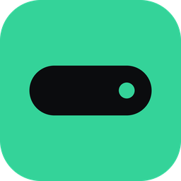
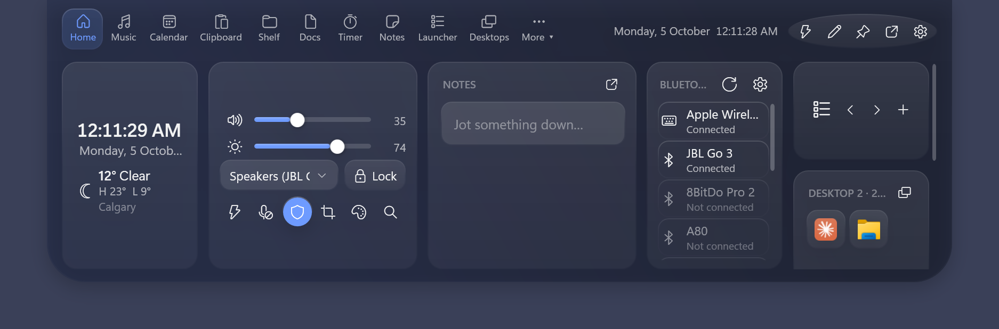
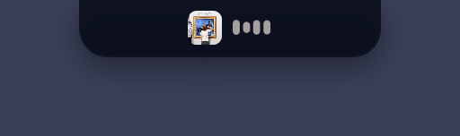
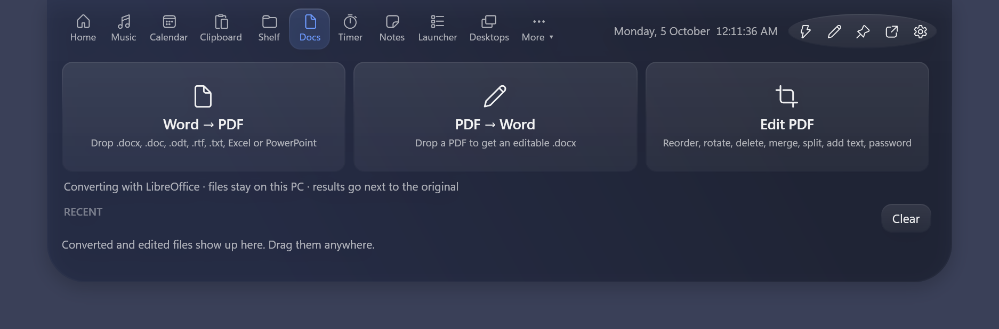
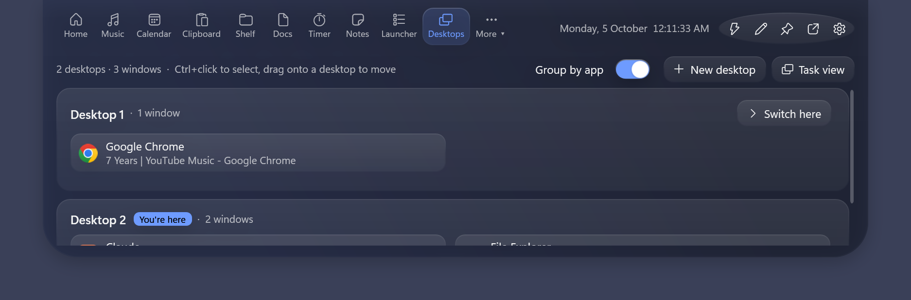
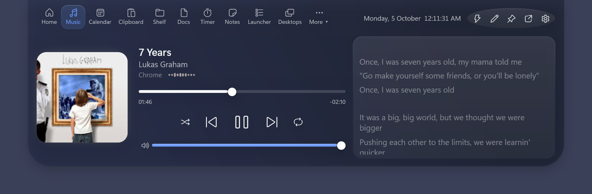
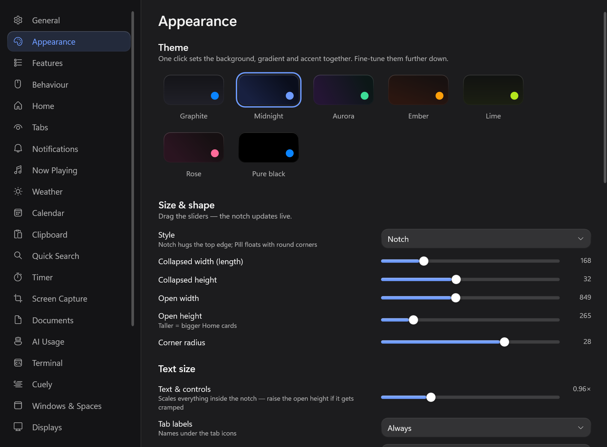

<p align="center">
  
</p>

<h1 align="center">NotchX</h1>

<p align="center">
  A modern notch-style utility for Windows, inspired by the experience of using a similar app on macOS and extended with features built specifically for Windows.
</p>

<p align="center">
  <a href="https://github.com/Navneet035/NotchX/actions"></a>
  
  
</p>

<p align="center">
  
</p>

I couldn't find a close equivalent for Windows, so I built one myself. The project combines the idea that inspired me with my own functionality, with a simple goal: make everyday desktop tasks a little faster and easier.

## Why I Built This

I really enjoy building small tools that make everyday tasks simpler and save a little time.

I came across a macOS app that used the notch in a really clever and useful way, and I really liked the experience. When I looked for something similar on Windows, I couldn't find an app that offered the same kind of experience.

So I decided to build one myself.

This project brings a similar notch-style experience to Windows, while also adding functionality of my own that goes beyond the original inspiration. The goal is to make the Windows desktop a little more useful, interactive, and convenient without adding unnecessary complexity.

This project was **inspired by [Notchy](https://notchy.dev) for macOS**, but it is independently developed for Windows with its own implementation and additional features.

## Features

### The notch

<p align="center">
  
</p>

- **Works on any Windows 10/11 PC** — a small black pill at the top of the screen, notch or no notch.
- **Hover or click to open**; it closes on its own when the mouse leaves. Every gesture can be switched off.
- **Live activities, side by side** — music, a running timer, downloads, your latest note, the terminal, builds — ranked so the most important comes first.
- **Islands** — short pop-ups for whatever just happened, with buttons where useful (Open, Show in folder, Snooze, Allow…).
- **Peek on hover** — mini play / pause controls without opening the panel.
- **Choose which tab opens** — a fixed tab, the last one you used, or "smart" (music while something plays, the timer while it runs).
- **Right-click menu** — default tab, edit layout, settings.
- **Gestures** — scroll or two-finger swipe to switch tabs, scroll on the closed pill to change volume, `Ctrl+1–9` for tabs.
- **Pop out any tab** into its own floating window — always on top, or pinned to the desktop like a widget.
- **Hidden from screen capture** with one switch — invisible in OBS, Zoom, Teams and screenshots.
- **Hides while a game or video is fullscreen.**
- **Any display** — choose the monitor, notch or floating-pill style, and an offset below a taskbar or bezel.

### Make it yours
- **Size & shape** — width and height (closed and open), corner radius.
- **Themes** — Graphite, Midnight, Aurora, Ember, Lime, Rose or Pure black in one click; everything stays adjustable.
- **Colours** — solid black, any colour, a gradient, or your own picture; accent colour, and a separate tab-highlight colour and strength.
- **Frosted glass** — optional live blur of what's behind the open notch, with tint and a sheen-and-rim highlight.
- **Text size** — scale everything inside the notch.
- **Animations** — springy open / close, adjustable speed, or off.
- **Tabs** — named icons; show, hide and reorder them (in the notch or in Settings); tabs that don't fit go on a second row or into a **More ▾** menu; turn any feature off completely.
- **Clock** — 12- or 24-hour, seconds, AM/PM and date style.
- **Your own icons** — give any Launcher or Shelf item a custom picture.
- **Settings** — 26 pages, every change previews live, and everything is also in a plain `settings.json` you can edit.

### A Home page you design
- **22 cards** — clock, weather, world clocks, Now Playing, volume & output, brightness, quick toggles, sound & brightness (all-in-one), Bluetooth, battery, reminders, calendar, notes, clipboard, shelf, camera, screen time, Spaces (virtual desktops), open windows, timer, system stats and apps.
- **Arrange them in the notch** — click ✎, then **+ Add card**; move, resize (width and height), remove or drag cards onto each other.
- **Or in Settings › Home** — with a live preview of the layout.
- Cards sit on a 12-column grid; short cards slide in under tall ones, and extra rows scroll.

### Music & sound
- **Now Playing** — Spotify, YouTube Music / YouTube in any browser, Apple Music, Media Player and anything else in Windows' media controls.
- Album art, scrubbing, shuffle, repeat, per-app volume, and playback speed for browser videos. Click the album art to jump to the app that's playing.
- **Live audio spectrum** — real analysis of what you hear, in the tab and optionally on the pill.
- **Synced lyrics** (LRCLIB), in the tab or line-by-line on the pill.
- **Sound mixer** — volume and mute per app, without touching the system volume.
- **Output switcher** — speakers ⇄ headphones in one click (also from the command palette), with an island when it changes.
- **One-click microphone mute** — silences every mic at once, so Zoom, Meet and Teams all go quiet.

### Productivity
- **Clipboard history** — text, images and files; pins that survive clearing; search, including text *inside* images (on-device OCR).
- **Smart clipboard actions** — open links, compose emails, colour swatches, and paste straight back into the app you were using. Password managers are never recorded.
- **File shelf** — drop files on the notch, drag them out anywhere later; survives restarts. Zip, unzip, and convert images (PNG, JPEG, TIFF, BMP, GIF, HEIC, PDF → images) offline.
- **Quick notes** — the newest open note rides on the pill until you tick it off.
- **Reminders in plain words** — "Call Sam tomorrow 9am", "Stretch in 20m"; snooze or mark done from the island.
- **Calendar** — Google, Outlook / Exchange and iCloud through their private iCal links (no sign-in), with alerts and Zoom / Meet / Teams **Join** buttons.
- **Pomodoro timer** — focus / break chaining, countdowns, a drift-free stopwatch, streaks, a 7-day chart, and a mascot on the pill 🐢 🐇 🐱 🦊 🐧 🚀 🍅.
- **Command palette** (`Ctrl+Shift+Space`) — every tab and action, inline maths, web search, snippets.
- **Search & translate** — 9 search engines plus your own, live translation, a calculator with history, and saving a video from a link (with yt-dlp).
- **Text snippets** — paste saved text with `{date}`, `{time}` and `{clipboard}` placeholders; your clipboard is restored afterwards.
- **App launcher** — pin your apps, pick from the Start menu or drop shortcuts in, drag to reorder, run as administrator.
- **Cuely teleprompter** — your script scrolls right under the webcam during calls; speed, size and mirror.
- **Camera mirror** — check yourself before a call; nothing is recorded.

### Documents & PDF
- **Word → PDF** — also Excel, PowerPoint, OpenDocument, RTF and text files.
- **PDF → Word** — an editable `.docx`.
- **PDF editor** — reorder pages (drag or move), rotate, delete, merge other PDFs, extract selected pages, split into single pages.
- **Add to a PDF** — text at the top or bottom, a diagonal watermark, page numbers, and a password.
- Originals are never overwritten; results appear under **Recent**, ready to drag anywhere.

<p align="center">
  
</p>

### Screen capture
- **Drag a box** — the screen freezes, you select, and the shot is **copied to the clipboard**. Works on every monitor; `Enter` takes the whole screen.
- Also put it on the shelf and / or save it to a folder; a preview island you can drag into any app; an optional keyboard shortcut.
- Or use Windows' Snipping Tool instead.
- **Colour eyedropper** — a magnifier follows the cursor; click to copy the hex code.

### System & devices
- **Volume, brightness and Caps Lock HUDs** — as an island, a bar on the screen edge, or a round gauge, at any size. Can replace the Windows volume pop-up.
- **Brightness** — built-in screens, and external monitors over DDC/CI.
- **Bluetooth** — paired devices, connected or not, with battery for mice, keyboards and headphones; one click to Windows' quick connect.
- **AirPods** — battery for each bud and the case when the case opens nearby.
- **Battery** — charging / unplugged islands, a "fully charged" reminder (80–100%), and a low-battery alert with sound.
- **Caffeine (keep awake)** — on, for 30 min / 1 h / 3 h, or until a time; screen on or off; turns itself off on low battery. Middle-click the tray icon to toggle.
- **Download alerts** — from any browser, no extension; open, show in folder or put on the shelf.
- **USB drives** — an island when one is plugged in, with **Eject** and "safe to remove".
- **Screenshots** — Win+PrtScn and Snipping Tool saves are staged on the shelf.
- **Privacy dot** — green while the camera is in use, orange for the microphone.
- **Notifications from other apps** — WhatsApp, Teams, Outlook and the rest slide out of the notch, with an unread count on the pill and a Notifications tab; mute apps or hide message text (Microsoft Store version).
- **Do Not Disturb** — follows Windows Focus; low-priority islands stay quiet.
- **Screen time** — today's time on the PC and your top apps; idle time and the lock screen don't count.
- **Spaces** — see which virtual desktop you're on, switch, add one or open Task view; an island names the desktop when you switch.
- **Desktops tab** — every virtual desktop with the apps and windows open on it. Click to jump to a window, drag windows (or a Ctrl+click selection) onto another desktop to move them, or minimise and close them from the list.
- **Weather & world clocks** — search for any city as you type, keep a list of places, and see each one's time, how far ahead or behind it is, and its weather.
- **Window snapping** — drag a window to the notch and drop it on a layout zone (optional).
- **Terminal** — a drop-down Windows Terminal from the top edge (or a normal window), with show, hide and close.
- **System stats** — CPU, memory, network and disk with live graphs.
- **Lock screen** in one click, **keyboard cleaning lock** (60 s, `Ctrl+Esc` unlocks) and a **keystroke HUD** for presentations (password fields are never shown).
- **Permissions page** — see at a glance whether camera, microphone and location are allowed, with links to fix them.

<p align="center">
  
</p>

### For developers
- **Local API** — `127.0.0.1` only, token-protected, off by default; scripts, CI and shells can show their own islands.
- **Claude Code approvals** — when Claude Code asks for permission, click **Allow** or **Deny** in the notch.
- **Agent activity** — Claude Code turns with per-turn cost, and Codex turn-complete islands.
- **AI usage** — Claude Code and Codex from local logs (5-hour windows, tokens, cost, rate limits) and GitHub Copilot quota, with alerts before you hit a limit.
- **Shell activity** — long PowerShell commands become live islands, with a ✓ or ✗ when they finish.

<p align="center">
  
  
</p>

## Download

1. Download **NotchX-win-x64.zip** from the [latest release](https://github.com/Navneet035/NotchX/releases/latest) (or `NotchX-win-arm64.zip` for Windows on ARM).
2. Unzip it and run `NotchX.exe` — no installer and no admin rights needed.
3. Optional: Settings › General › **Start NotchX with Windows**.

Windows SmartScreen may warn that the app isn't recognised (it isn't code-signed yet); choose **More info › Run anyway**.

Your settings and data are kept in `%APPDATA%\NotchX`.

**Word ⇄ PDF** uses Microsoft Word if you have it, or the free [LibreOffice](https://www.libreoffice.org/download/download-libreoffice/). Everything else works out of the box.

## Build from source

On Windows 10 (2004+) or 11:

```powershell
git clone https://github.com/Navneet035/NotchX.git
cd NotchX
.\build.ps1            # installs the .NET 8 SDK if needed, then runs NotchX
.\build.ps1 -Publish   # builds a single NotchX.exe in .\publish
```

## Using it

| Do this | To |
|---|---|
| Hover over or click the pill | Open it |
| `Ctrl+Shift+Space` | Command palette |
| `Ctrl+Shift+N` | Open / close the notch |
| ✎ in the header | Arrange Home cards and tabs |
| Right-click the notch | Choose which tab opens, edit the layout, settings |
| Drag files onto the pill | Put them on the shelf |
| Scroll on the closed pill | Change volume |

## Privacy

NotchX runs entirely on your PC. Clipboard history, screen time, notes and documents never leave it. The only features that go online are weather and city search (Open-Meteo), synced lyrics (LRCLIB), calendar feeds you add, translation when you use it and, if you add a token, your Copilot usage. There are no accounts, ads or analytics. Full details: [privacy policy](docs/PRIVACY.md).

## Roadmap

- Cursor AI usage
- Per-app equaliser
- Animated idle pill

See [docs/FEATURES.md](docs/FEATURES.md) for every feature, how it maps to Windows, and where it lives in the code.

## Credits

Built by **Navneet**. Inspired by [Notchy](https://notchy.dev) for macOS.
Lyrics by LRCLIB · Weather by Open-Meteo · Audio via NAudio · PDF editing via PDFsharp.

## Licence

[MIT](LICENSE) © 2026 Navneet
